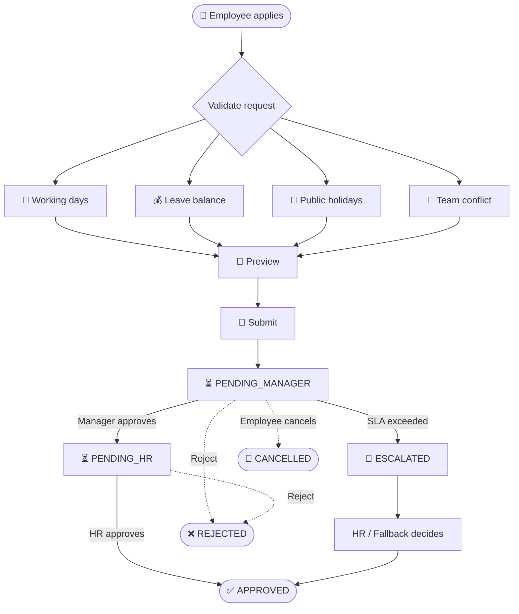
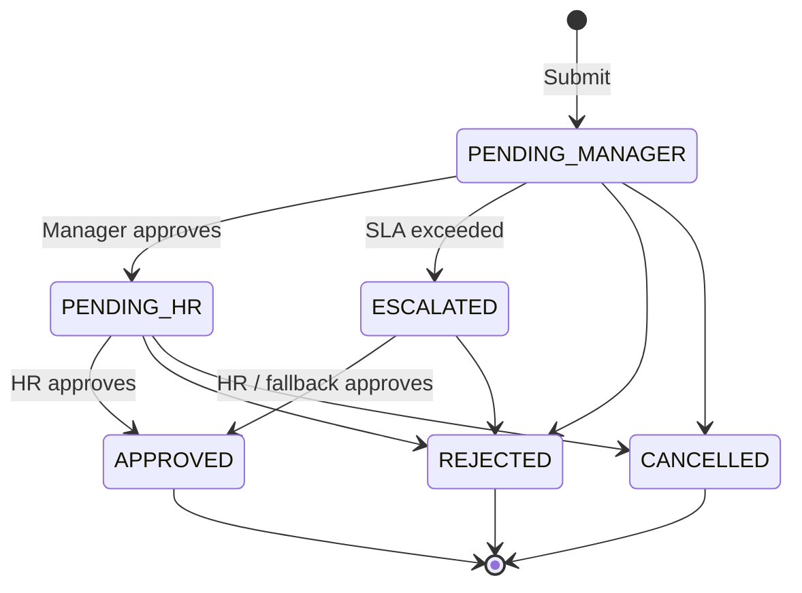
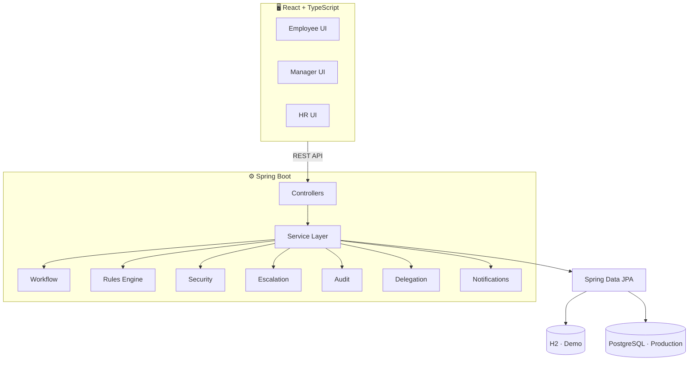

<div align="center">

# 🔷 LeaveFlow

### Leave management that's **explainable**, **accountable** and **auditable**

*Rule-driven approvals · Team coverage awareness · Automatic escalation · Full audit trail*

<br/>


**🏆 Acentra Health · BUILD TO CARE &nbsp;|&nbsp; 👥 Team The Prism**

[Overview](#-why-leaveflow) • [Features](#-features) • [Workflow](#-approval-workflow) • [Rules](#-rules-you-can-explain) • [Architecture](#-architecture) • [Quick Start](#-quick-start) • [Team](#-team--the-prism)

</div>

---

## 💡 Why LeaveFlow?

> Most leave tools are just a form. **Real organisations need a decision workflow.**

A leave request isn't only "dates + submit". Someone has to check the balance, skip holidays, spot that half the team is already off, chase a manager who's gone quiet, and leave a trail that HR can trust later.

LeaveFlow does all of that, and it **shows its working**.

| ❌ The usual problem | ✅ The LeaveFlow answer |
|---|---|
| Approvals stall when a manager is away | **SLA timers → reminders → escalation** to HR / fallback |
| Wrong balances, weekends counted as leave | **Working-day engine** that excludes weekends and public holidays |
| "Why is my balance 12?" | **Visible pro-rata calculation**, not a mystery number |
| Whole team off the same week | **Coverage-aware conflict flags** for reviewers |
| Nobody knows who approved what | **Append-only audit trail** for every action |
| Frontend-only permissions | **Backend-enforced RBAC**, ownership and delegation checks |

---

## ✨ Features

<table>
<tr>
<td width="50%" valign="top">

### 📋 Leave Management
- Apply for leave with a live **preview**
- Working-day calculation
- Public-holiday exclusion
- Leave-balance validation
- Pro-rata entitlement for mid-year joiners
- Request tracking and timelines

</td>
<td width="50%" valign="top">

### 🔄 Approval Workflow
- **Employee → Manager → HR** chain
- Explicit request states
- Centralised transition logic
- Rejection and cancellation handling
- SLA-based escalation
- Approval delegation

</td>
</tr>
<tr>
<td width="50%" valign="top">

### 👥 Team Conflict Detection
- Detects overlapping teammates' leave
- Calculates team-level impact
- **Flags for review, never auto-rejects**
- Coverage-aware analysis
- Can weigh critical team skills

</td>
<td width="50%" valign="top">

### 🔐 Security & Access
- JWT authentication
- BCrypt password hashing
- Role-based access control
- Ownership and delegation validation
- All authorization enforced server-side

</td>
</tr>
<tr>
<td width="50%" valign="top">

### 🧾 Auditability
Every important action is stored in an **append-only** trail:
`actor` · `action` · `previous status` · `new status` · `comment` · `timestamp`

</td>
<td width="50%" valign="top">

### 🔔 Notifications
- In-app notifications
- Email-outbox architecture for reliable delivery of notification events

</td>
</tr>
</table>

---

## 🎭 One Platform, Three Experiences

| 🧑‍💼 Employee | 🧑‍🏫 Manager | 🛡️ HR |
|---|---|---|
| Apply for leave | Approval inbox | All requests |
| View balances | Team calendar | Escalated requests |
| Track requests | Conflict alerts | Holiday management |
| Request timelines | Delegations | Audit trail |
| Notifications | SLA information | Analytics |
| | Team analytics | Team capacity |

---

## 🔁 Approval Workflow



### 🧩 State Machine



All transitions live in **one central place** and are validated against the current state, requested transition, actor, role, ownership, delegation and business rules.

---

## 🧠 Rules You Can Explain

### 📅 Working Days

```text
Monday–Friday  −  Public Holidays  =  Actual Leave Days
```

### 📐 Pro-Rata Entitlement

```text
Annual Quota × Eligible Months / 12
```

> **Example:** 24-day quota, joins 1 July → 6 eligible months → `24 × 6 / 12 =` **12 days**

The UI exposes the calculation instead of showing an unexplained balance.

### ⚠️ Team Conflict Threshold

```text
(Overlapping Teammates + 1) / Team Size  >  30%
```

> **Example:** team of 10
> - 2 teammates overlap → `3/10 = 30%` → ✅ not flagged
> - 3 teammates overlap → `4/10 = 40%` → ⚠️ **flagged for review**

A conflict is a **signal for the approver**, not an automatic rejection.

---

## 🏗️ Architecture



**Principle:** `Controller → Service → Repository`. Controllers stay thin, business logic lives in the service layer, and the API exposes **DTOs**, never persistence entities.

### 🗄️ Core Domain Model

`User` · `Team` · `LeaveType` · `LeaveBalance` · `LeaveRequest` · `ApprovalStep` · `Delegation` · `Holiday` · `AuditEvent` · `Notification` · `EmailOutbox`

The workflow centres on `LeaveRequest` and its `ApprovalStep`, audit and notification records.

---

## 🛠️ Tech Stack

| Layer | Technologies |
|---|---|
| **Backend** | Java 17 · Spring Boot 3 · Spring Web · Spring Data JPA · Hibernate · Bean Validation · Spring Security · JWT · BCrypt · Maven · OpenAPI / Swagger |
| **Frontend** | React · TypeScript · Vite · Tailwind CSS · React Router · TanStack Query · Axios · Recharts |
| **Database** | H2 (demo) · PostgreSQL (production profile) |
| **Infra / Other** | Docker · Docker Compose · `@Scheduled` jobs for escalation |

---

## 🚀 Quick Start

> ⚙️ Adjust paths and commands to match your repo layout.

```bash
# 1. Clone
git clone <your-repo-url>
cd leaveflow

# 2. Backend (H2 demo profile)
cd backend
mvn spring-boot:run

# 3. Frontend
cd ../frontend
npm install
npm run dev
```

**Or with Docker:**

```bash
docker compose up --build
```

📖 API docs are available through Swagger UI once the backend is running.

<!-- 🔑 Add demo accounts here: Employee / Manager / HR -->

---

## 🖼️ Screenshots

<!-- Replace with real screenshots -->
| Employee: Apply & Preview | Manager: Approval Inbox | HR: Audit Trail |
|---|---|---|
| *screenshot* | *screenshot* | *screenshot* |

---

## ⚖️ Deliberate Design Boundaries

We kept the system modular and practical on purpose. LeaveFlow intentionally avoids:

`Microservices` · `Kafka` · `MongoDB` · `Firebase` · `Node/Python backend` · `Angular` · `Spring State Machine` · `Unnecessary AI/LLM components`

The workflow is plain, testable, **application-level Java state-transition logic**.

---

## 👥 Team · The Prism

| Member | Registration ID |
|---|---|
| **Keerthana** | RA241103010552 |
| **Abhinaya** | RA2411026010183 |
| **Deepan Kumar S** | RA241103010888 |
| **Madhanmithran P** | RA241103010854 |
| **SanjithKumar** | RA241103010576 |

---

<div align="center">

### 🏆 Acentra Health BUILD TO CARE

**Team:** The Prism &nbsp;•&nbsp; **Project:** LeaveFlow

<br/>

> *LeaveFlow turns leave management from a simple submission form into an*
> ***accountable, explainable and auditable*** *workforce decision workflow.*

</div>
