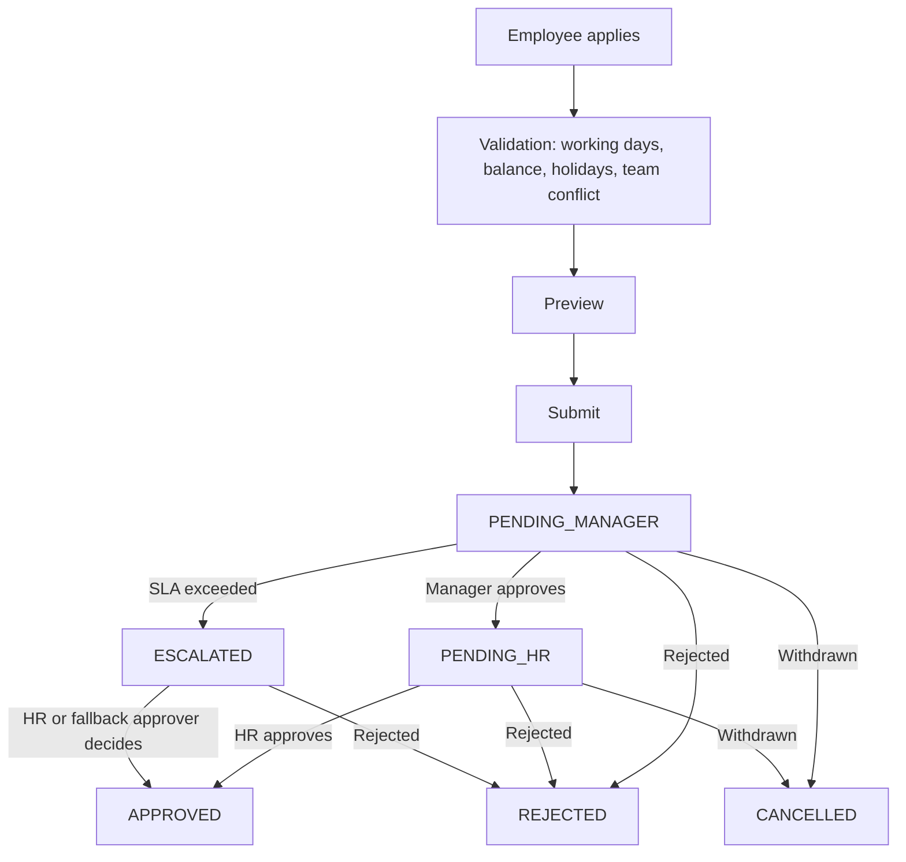
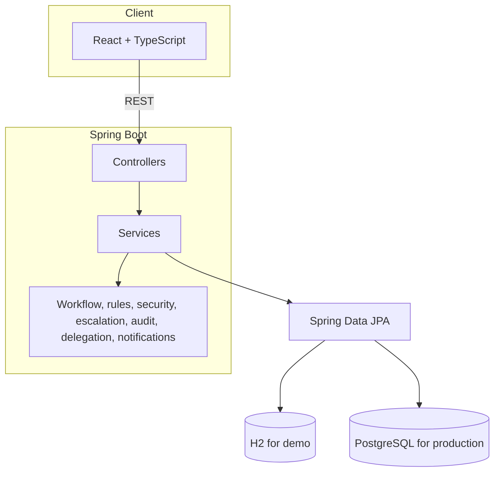

# LeaveFlow

A leave approval platform for organisations where a leave request has to pass through more than one person, respect team capacity, and leave a record that can be checked later.

Built by team **The Prism** for the **Acentra Health BUILD TO CARE** hackathon.

---

## Contents

1. [The problem](#the-problem)
2. [What LeaveFlow does](#what-leaveflow-does)
3. [How a request moves](#how-a-request-moves)
4. [Business rules](#business-rules)
5. [Roles](#roles)
6. [System design](#system-design)
7. [Tech stack](#tech-stack)
8. [Running the project](#running-the-project)
9. [Scope decisions](#scope-decisions)
10. [Team](#team)

---

## The problem

Submitting a leave form is the easy part. The difficult parts come afterwards:

- A manager is unavailable and the request sits untouched.
- Weekends and public holidays get counted against the employee's balance.
- Someone who joined in the middle of the year is given a full-year quota, or a number nobody can justify.
- Several people from one team apply for the same week and nobody notices until it is too late.
- Months later, no one can say who approved a request or when.

LeaveFlow is built around these situations rather than around the form.

---

## What LeaveFlow does

**Checks a request before it is submitted.** The employee sees the working days counted, the balance that will remain, any holidays that fall inside the range, and whether teammates are already away.

**Routes it through a fixed approval chain.** Every request goes from the employee to the manager and then to HR. If the manager does not respond within the configured time, the request is escalated.

**Flags coverage problems without deciding for anyone.** When too much of a team would be absent, the approver is warned. The system never rejects a request on this ground by itself.

**Records every step.** Each approval, rejection, cancellation and escalation is written to an append-only audit log.

**Shows its arithmetic.** Working days and pro-rata entitlement are displayed with the calculation, so users can see how a number was reached.

Other capabilities include approval delegation, holiday management, in-app notifications, an email outbox for outgoing notifications, and analytics for managers and HR.

---

## How a request moves



### States

| State | Meaning |
|---|---|
| `PENDING_MANAGER` | Waiting for the reporting manager |
| `PENDING_HR` | Manager has approved, waiting for HR |
| `ESCALATED` | Manager did not act within the SLA |
| `APPROVED` | Final approval given |
| `REJECTED` | Declined at any stage |
| `CANCELLED` | Withdrawn before a final decision |

All state changes go through one piece of transition logic. Before a change is accepted, it is checked against the current state, the requested transition, the person acting, their role, whether they own the request, any delegation in force, and the relevant business rules.

---

## Business rules

### Counting leave days

```text
Weekdays (Mon-Fri) in the range  minus  public holidays  =  leave days charged
```

### Pro-rata entitlement for mid-year joiners

```text
Annual quota x eligible months / 12
```

For example, with a 24-day annual quota and a joining date of 1 July, there are 6 eligible months, so the entitlement is 24 x 6 / 12 = 12 days.

### Team conflict

```text
(overlapping teammates + 1) / team size > 30%
```

For a team of 10, two overlapping teammates give 3/10 = 30%, which is not flagged. Three overlapping teammates give 4/10 = 40%, which is flagged. The threshold is configurable. A flag prompts the approver to look closer; it does not block the request.

---

## Roles

| Role | Responsibilities |
|---|---|
| Employee | Apply for leave, view balances, follow request status and history, read notifications |
| Manager | Review team requests, see conflict alerts and SLA timers, use the team calendar, delegate approvals, view team analytics |
| HR | Give final approval, handle escalated requests, manage holidays, inspect the audit trail, view analytics and team capacity |

Permissions are enforced on the server. Hiding a button in the interface is never the only protection.

---

## System design



The layering is Controller, Service, Repository. Controllers stay thin and business logic sits in the service layer. The API returns DTOs instead of exposing JPA entities.

### Domain model

`User`, `Team`, `LeaveType`, `LeaveBalance`, `LeaveRequest`, `ApprovalStep`, `Delegation`, `Holiday`, `AuditEvent`, `Notification`, `EmailOutbox`

`LeaveRequest` is the central entity. Each request has its own approval steps, audit events and notifications.

### Audit record

Each entry stores the actor, the action, the previous status, the new status, an optional comment and the time. Entries are only ever added, never edited.

---

## Tech stack

| Area | Tools |
|---|---|
| Backend | Java 17, Spring Boot 3, Spring Web, Spring Data JPA, Hibernate, Bean Validation, Spring Security, JWT, BCrypt, Maven, OpenAPI/Swagger |
| Frontend | React, TypeScript, Vite, Tailwind CSS, React Router, TanStack Query, Axios, Recharts |
| Database | H2 (demo), PostgreSQL (production profile) |
| Other | Scheduled jobs using `@Scheduled` for escalation, Docker and Docker Compose |

---

## Running the project

Update the paths and commands below to match the repository.

```bash
git clone <repository-url>
cd leaveflow

# backend
cd backend
mvn spring-boot:run

# frontend (in a second terminal)
cd frontend
npm install
npm run dev
```

With Docker:

```bash
docker compose up --build
```

Swagger UI is available once the backend has started.

<!-- Add demo accounts for the Employee, Manager and HR roles here. -->

---

## Scope decisions

To keep the project easy to reason about, these were left out on purpose: microservices, Kafka, MongoDB, Firebase, a Node or Python backend, Angular, Spring State Machine, and any AI or LLM component that the problem did not require. The workflow is ordinary Java transition logic.

---

## Team

Team **The Prism**

| Member | Registration ID |
|---|---|
| Keerthana | RA241103010552 |
| Abhinaya | RA2411026010183 |
| Deepan Kumar S | RA241103010888 |
| Madhanmithran P | RA241103010854 |
| SanjithKumar | RA241103010576 |
